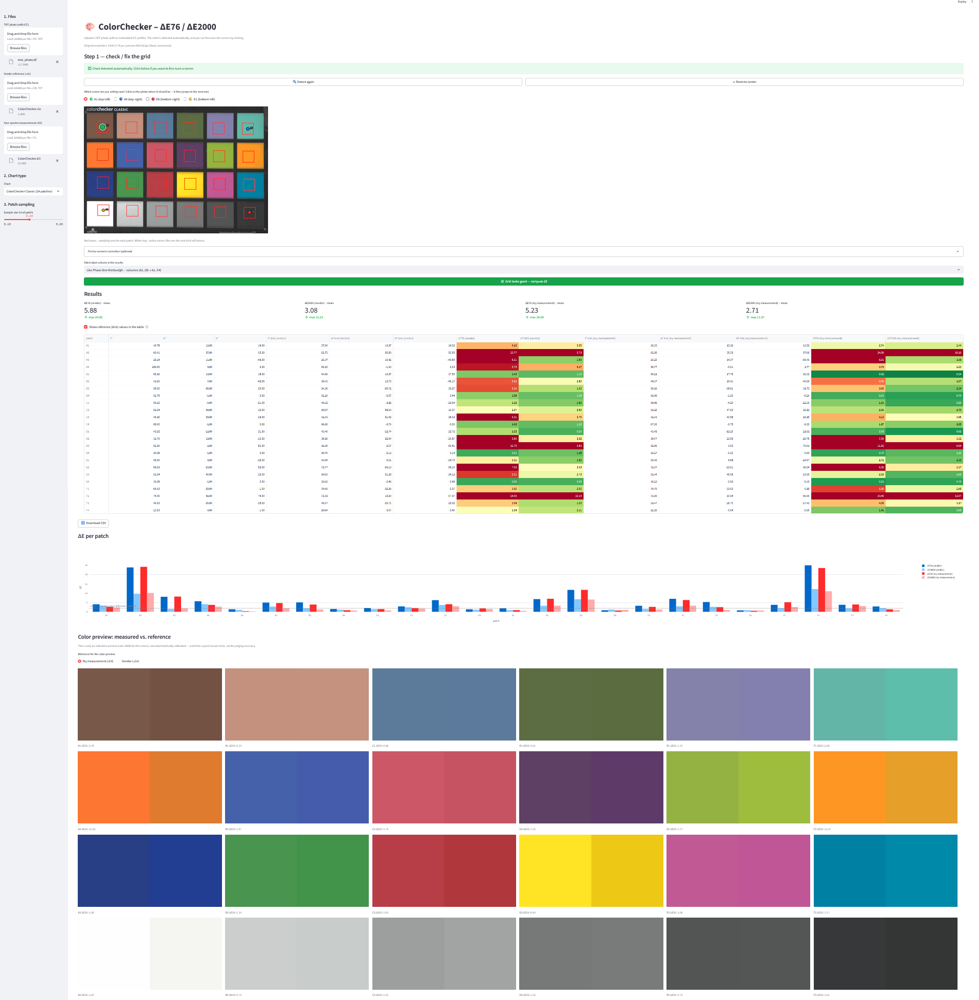

# ColorChecker ΔE — ΔE76 / ΔE2000 Analyzer

A Streamlit app that computes **ΔE76** and **ΔE2000** for an X-Rite/Calibrite
**ColorChecker Classic** target, directly from a photographed TIFF with an
embedded ICC profile - no manual patch clicking, no spreadsheet math.

Built for a workflow using **TIFF** export with embedded ICC profile, an **spectrophotometer** (own
measurement of the physical chart, `.ti3`), and vendor reference data (`.cie`). 

The script was created to enable the **local measurement** of color reproduction quality in photographs.

---

<p align="center">
  
</p>

## What it does

1. **Load a TIFF** with an embedded ICC profile.
2. **Detect the ColorChecker Classic** automatically (`cv2.mcc`), or fine-tune
   the 4 corners by clicking on a fixed-size preview — no scrubbing through
   sliders, no dragging.
3. **Sample each of the 24 patches** from the *original, full-resolution*
   image (median of the pixels in the center of each patch, avoiding
   borders/shadows).
4. **Convert measured RGB → Lab** through the TIFF's own embedded ICC
   profile (via LittleCMS/`PIL.ImageCms`) — not an assumption of sRGB or
   AdobeRGB.
5. **Compare against your reference(s)**:
   - vendor Lab data (`.cie`)
   - your own spectrophotometer measurement of that physical chart (`.ti3`,
     XYZ → Lab, D50) — usually the more accurate ground truth, since
     individual chart units vary from the generic vendor average
6. **Report ΔE76 and CIEDE2000** per patch, with a color-coded table, a bar
   chart, side-by-side color swatches, and a CSV export.

---

## Why the ICC step matters

The core of this tool is that it reads the color through the **exact ICC
profile embedded in your TIFF** rather than assuming a generic working space. This has been cross-validated against
Phase One NimbusQA: for the same physical patch, the measured L\*a\*b\*
values from this tool and from NimbusQA agree to within ~0.1–0.2 Lab units.

---

## Requirements

- Python 3.9+
- Any tool that can export a TIFF with an embedded ICC profile
- OPTIONAL:  ArgyllCMS and a spectrophotometer (for generating your own `.ti3` measurement) — external tools, not part of this app


Python packages (see `requirements.txt`):

```
streamlit==1.40.0
streamlit-image-coordinates==0.4.0
opencv-contrib-python
pillow
numpy
pandas
plotly
```

### ⚠️ Pinned versions — please read

- **`streamlit==1.40.0`** and **`streamlit-image-coordinates==0.4.0`** are
  pinned deliberately. Newer Streamlit releases (1.4x+) moved/renamed
  internal APIs (`streamlit.elements.image.image_to_url` and related) that
  `streamlit-image-coordinates` depends on — installing an unpinned/newer
  Streamlit will break the corner-picker with an `AttributeError` or
  `ImportError`. Don't `pip install --upgrade streamlit` in this
  environment without checking compatibility first.
- **`opencv-contrib-python`, not `opencv-python`.** Auto-detection uses the
  `cv2.mcc` module, which only ships in the `-contrib` build. The two
  packages conflict and **cannot both be installed** in the same
  environment.

If you already have the wrong ones installed:

```bash
pip uninstall opencv-python opencv-python-headless -y
pip install -r requirements.txt --force-reinstall
```

---

## Installation

```bash
git clone <this-repo-url>
cd <this-repo>
pip install -r requirements.txt
```

(Use a virtualenv if you'd rather not touch system packages; drop `--force-reinstall` for a normal first install.)

## Running

```bash
python -m streamlit run colorchecker_app.py
```

Use `python -m streamlit run ...` rather than the `streamlit` executable
directly — on some Windows Python installs the `streamlit.exe` launcher
script points at a stale interpreter path and fails with `Fatal error in
launcher`. Running it as a module sidesteps that.

### Large TIFFs (Phase One 150MP and similar)

Streamlit's default upload limit is 200MB. For bigger files:

```bash
python -m streamlit run colorchecker_app.py --server.maxUploadSize 2000
```

(value in MB). The on-screen preview is always downscaled to a fixed size —
the original resolution never affects how big anything looks on screen, only
upload size.

### Running on a different port

If another Streamlit instance is already using the default port:

```bash
python -m streamlit run colorchecker_app.py --server.port 8502
```

---

## Usage

1. **Sidebar → 1. Files**
   - Upload the TIFF photo with embedded ICC profile (If you don't have one, you can use the `example_photo.tif` file included in the package for testing purposes.).
   - Upload `.cie` vendor reference (They are included with the files in the repository) and/or `.ti3` (your spectrophotometer measurement. I’m attaching ExampleMeasurement.ti3 so you can see the structure of the reference file.) — at least one is required to compute ΔE.
2. **Sidebar → 2. Chart type**
   - `ColorChecker Classic (24 patches)` — fully supported, auto-detected.
   - `ColorChecker SG` — listed for future support; no `.cht` geometry has
     been measured for it yet, so it falls back to fully manual corners.
   - `Custom chart` — define your own row × column grid; no auto-detect,
     manual corners only.
3. **Sidebar → 3. Patch sampling**
   - Slider for what fraction of each patch to sample from (smaller = safer against edge artifacts/shadows, larger = more pixels averaged).
4. **Step 1 — check / fix the grid**
   - The chart is detected automatically on upload. If it's off, or
     detection failed, use the corner selector (🟢A1 🔵A6 🔴D6 🟡D1) and click on the photo where that corner should be — it jumps to the next corner automatically after each click.
   - "Precise numeric correction" expander lets you type exact pixel
     coordinates instead of clicking.
5. **Select a patch label scheme**, then click **"Grid looks good — compute ΔE"**.
6. **Results**: color-coded table (green = low ΔE, red = high), a ΔE-per- patch bar chart with a ΔE≈2 just-noticeable-difference reference line, side-by-side measured-vs-reference color swatches, and a CSV download.

### Toggling reference (Aim) columns

The "Show reference (Aim) values in the table" checkbox is a pure display filter — the underlying computation (ICC transform, sampling, ΔE) only runs once, when you click the compute button. Toggling the checkbox does **not** recompute anything; it just shows/hides the `L*/a*/b* Aim` columns in the table you're already looking at. The CSV download always contains every column regardless of the toggle.

---

## Patch label schemes

X-Rite/Calibrite's own chart layout (and the `.cht`/`.cie`/`.ti3` files this tool reads) numbers patches **by row**: `A1`–`A6` is the top row left to right, `B1`–`B6` the next row down, etc.

**Phase One NimbusQA numbers patches by column instead**: its `A1`–`A4` is the *first column* top to bottom, its `B1`–`B4` the second column, and so on. Same 24 physical patches, different label convention — comparing rows by label between the two tools without accounting for this will look like wildly different results even when the underlying measurements agree.

This app can display results in either scheme:

- **`Argyll/.cht — rows`** (default): matches your `.cie`/`.ti3` files and ArgyllCMS conventions.
- **`Like Phase One NimbusQA — columns`**: remaps every label so it lines up 1:1 with NimbusQA's own output, for direct side-by-side comparison.

The remap is a straightforward transpose (`row_letter+col_number` →
`new_letter(col_index)+row_number`), verified against NimbusQA screenshots
patch-by-patch (dark skin → A1, orange → A2, white → A4, etc.). It's a pure
relabeling for display/export — it does not change where anything is
sampled.

---

## How the grid/geometry works

- The four corner-fraction constants baked into `CHART_CONFIGS["classic"]`
  (`A1`, `A6`, `D6`, `D1`) were computed directly from a real ColorChecker
  Classic `.cht` file (Argyll chart-recognition geometry): total board
  330×228 units, with e.g. patch `A1`'s center at `(35.25, 34.75)` — i.e.
  `(0.10682, 0.15241)` as a fraction of the board. These are **not**
  generic/guessed proportions.
- When auto-detection runs, `cv2.mcc.CCheckerDetector` finds the outer
  bounding box of the physical chart; a perspective homography then maps
  those corner fractions onto the actual photo to get accurate patch-center
  positions even under mild perspective/rotation.
- The remaining 20 patch centers are interpolated via a perspective
  homography across the 4 corner points (`cv2.getPerspectiveTransform`),
  which handles keystone distortion from off-axis photography — a straight
  bilinear interpolation would not.

## Known Pillow gotcha (already handled)

`np.array(image)` on a Pillow image in `'LAB'` mode **mis-decodes the a/b
channels** — this is a real, verified quirk (confirmed: it disagrees with
`image.getpixel()` on the same pixel). The app reads Lab pixel data via
`image.getdata()` instead, which decodes correctly. If you extend this code
and are tempted to `np.array()` a Lab-mode image directly — don't.

---

## Extending to other chart types

`CHART_CONFIGS` is the single place that defines a chart type:

```python
"classic": {
    "label": "ColorChecker Classic (24 patches)",
    "rows": ["A", "B", "C", "D"],
    "cols": list(range(1, 7)),
    "corner_fracs": {...},        # from a real .cht file — see above
    "cv2_chart_type": "MCC24",    # cv2.mcc constant for auto-detect
    "auto_detect": True,
    ...
},
```

To add a new chart type with auto-detection (e.g. ColorChecker SG), you need
its `corner_fracs` measured from a real `.cht` file the same way Classic's
were — don't guess these from a product photo, they need to come from
Argyll's actual chart-recognition geometry. Without `corner_fracs`, the
entry still works but falls back to fully manual corner placement (as `sg`
and `custom` currently do).

---

## Troubleshooting

| Symptom | Cause | Fix |
|---|---|---|
| `AttributeError: module 'streamlit.elements.image' has no attribute 'image_to_url'` | Streamlit was upgraded past what `streamlit-image-coordinates` supports | `pip install -r requirements.txt --force-reinstall` to restore the pinned versions |
| `Fatal error in launcher` on Windows | Stale `streamlit.exe` launcher path | Run `python -m streamlit run colorchecker_app.py` instead |
| Preview image is huge / cropped to a tiny zoomed-in corner | Windows display scaling (125%/150%) combined with the click-picker rendering at native size | Already fixed in this version via an explicit `width=` on the picker; make sure you're on the current `colorchecker_app.py` |
| "No embedded ICC profile" error | TIFF was exported without an embedded profile | In Capture One, enable "Embed ICC Profile" on export |
| Auto-detection fails / picks the wrong region | Low contrast between chart and background, chart too small in frame, or an unsupported chart type | Use the manual corner-click flow (see [Usage](#usage)); this is expected to happen sometimes, it's not a bug |
| `ImportError` for `cv2.mcc` | Plain `opencv-python` installed instead of `opencv-contrib-python` | See [Requirements](#️-pinned-versions--please-read) above |
| Upload rejected / silently fails for a big TIFF | Default 200MB Streamlit upload limit | `--server.maxUploadSize 2000` (see [Running](#running)) |

---

## File format notes

- **`.cie`** — CGATS-format vendor reference, `SAMPLE_ID` + `LAB_L/LAB_A/LAB_B`
  per patch (e.g. `A01`, `A02`, ...). IDs are normalized (`A01` → `A1`) so
  either zero-padded or bare numbering works.
- **`.ti3`** — CGATS-format ArgyllCMS measurement file, `SAMPLE_LOC` +
  `XYZ_X/XYZ_Y/XYZ_Z` per patch. Converted to Lab assuming a D50 white point
  (`96.42, 100.0, 82.49`), matching Argyll/ICC PCS convention.
- Both parsers look for `BEGIN_DATA_FORMAT`/`END_DATA_FORMAT` and
  `BEGIN_DATA`/`END_DATA` blocks and handle quoted fields.

---

## ΔE formulas

- **ΔE76**: plain Euclidean distance in L\*a\*b\* space.
- **ΔE2000 (CIEDE2000)**: full implementation including the rotation term,
  verified against the standard Sharma et al. (2005) reference test dataset
  (matches published values to 4 decimal places on all checked cases).

Both are computed with `kL = kC = kH = 1` (no weighting).

---
